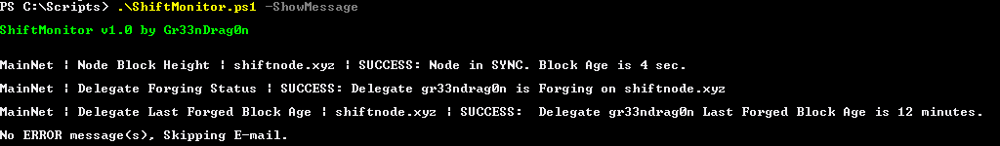

 

ShiftMonitor is a stand-alone PowerShell script to do end-user monitoring on Shift MainNet Node(s) and Delegate. It uses PowerShell so it run only on Windows but can monitor a node on any type of installation since it uses HTTP protocol to communicate with API.

Included features are:

 - Monitoring Block Height of every provided nodes URLs.
 - Monitoring Last Forged Block Height of configured delegate on all provided nodes URLs.
 - Monitoring Delegate Forging Status on all provided URLs.

Current Threshold values are 300 seconds for last block age and 90 minutes for last forged block age.

If you like it, please vote for me on Shift MainNet for Delegate or I accept donation. :)

Delegate: Gr33nDrag0n / Address: 17688865274499765764S

##**Installation**

Save a copy of ShiftMonitor.ps1

This README use this path C:\Scripts\ShiftMonitor.ps1, adjust accordingly if you use something else.

##**Configuration, Manual Usage & Testing**

Open the script in your favorite text editor. Basic Notepad WILL work but not recommended. I recommend notepad++ available for free [HERE](https://notepad-plus-plus.org/).

Scroll to line #72

> Configurable Variables | MANDATORY !!! EDIT THIS SECTION !!!

The configuration is splitted in sub-sections:

 - E-mail
 - MainNet

### **Configuring E-mail Section**

In this section we will configure the address used to send and received the monitoring automatic e-mails.

Config.          | Description                                                                    | Value Example
------------     | -------------                                                                  | -------------
SenderEmail      | This is the e-mail that will be used as sender by the script.                  | = 'ShiftMonitor@mydomain.com'
SenderSmtp       | This is the domain or IP address the script will use as SMTP to send messages. | = 'smtp.myinternetprovider.com'
SendErrorMail    | Enable/Disable the sending of errors messages.                                 | = $True
ErrorEmailList   | E-mail List                                                                    | = @('home@mydomain.com', '1234567890@phoneprovider.com')
 
###_About EmailList_

1 entry example:
> @('email@domain.com')

Multi-entries example:
> @('email@domain.com','5556781212@myphoneprovider.com')

You can use the same address for sender and recipient if you want.

###_About "email2sms"_
Most phone provider have email2sms functionnality. Just check with your provider, you probably already have an addres looking like:
> 9995551212@YourPhoneProvider.com

It allow text e-mail sent to this address to be redirected as sms to your phone.

Some existings eaxamples:

* AT&T – cellnumber@txt.att.net
* Verizon – cellnumber@vtext.com
* T-Mobile – cellnumber@tmomail.net
* Sprint PCS - cellnumber@messaging.sprintpcs.com
* Virgin Mobile – cellnumber@vmobl.com
* US Cellular – cellnumber@email.uscc.net
* Nextel - cellnumber@messaging.nextel.com
* Boost - cellnumber@myboostmobile.com
* Alltel – cellnumber@message.alltel.com

 
###**Configuring MainNet Section**

Start by entering your Delegate and Address. There is a function later to get the public key.

Edit the nodes section to add the http address of all your nodes.

#### Retreive Public Key

`.\ShiftMonitor.ps1 -ShowPublicKey`

Edit the script again to add the public key in the Delegate configuration.

#### Test E-mail Configuration

`.\ShiftMonitor.ps1 -SendTestEmail`

#### Run manually the check

`.\ShiftMonitor.ps1 -ShowMessage`

##**Scheduled Task(s) Creation & Testing**

The script do a check and send e-mail if necessary.

It's not a program, so like you would use crontab in Linux, you need to use Task Scheduler in Windows

Open Task Scheduler and Create a New Task. (Use Full GUI not the Wizard)

General -> Name: ShiftMonitor

General -> Execute even if user is not connected

Trigger -> New

			* One time
			* Repeat each "5 minutes" for a duration of "infinity"
			
Action  -> New

			* Command:          C:\Windows\System32\WindowsPowerShell\v1.0\powershell.exe
			* Arguments:        C:\Scripts\ShiftMonitor.ps1
			* WorkingDirectory: C:\Scripts\

##**Troubleshooting & Common Error(s)**

**It doesn’t work.**

Verify PowerShell version installed in your computer. Execute the following command:

> $PSVersionTable

The PSVersion must be at least v4.x.
If not, go [HERE](https://www.microsoft.com/en-us/download/details.aspx?id=40855), select your language, download, install and reboot.

When done re-run the test to confirm your version is now v4.x or upper.

**Script work but communication with server fail.**

Verify the configuration of the server (config,json) to allow your IP address in the whitelist section. Don’t forget to restart your Shift client to update the configuration.

**Script is asking confirmation to execute when running it.**

`Set-ExecutionPolicy -Scope CurrentUser -ExecutionPolicy Bypass`

**Using "Delegate Last Forged Block Age" You Receive "ERROR: Get-ShiftBlockList Result is NULL."**

Are you currently an active delegate ? You must be in the 101 active delegate to forge block.
